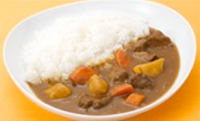

# おいしいカレーの作り方

###　材料(５皿分)
- S&Bとろけるカレー　             
1/2箱
- 肉（写真は牛もも肉）　
200g
- 玉ねぎ　
中1と1/2個（300g）
- にんじん　
小1本（100g）
- じゃがいも　
中１個（150g）
- サラダ油　
大さじ1
- 水　
700ml
- S&Bクミンシード　
小さじ1/2
- S&Bガラムマサラ　
適量
- S&Bローレル（ホール）　
1枚

###　①切る
1. ***野菜を切る***
   玉ねぎは皮をむき、たて半分に切ります。
1/2個分はみじん切りに、1個分を小さめの乱切りにします。
にんじん、じゃがいもは皮をむき、食べやすい大きさの乱切りにします。

###　②炒める
1. ***肉を炒める***
   鍋にサラダ油大さじ1を入れ、中火～強火で表面にしっかり焼き色がつくように炒め、とりだしておきます。

2. ***クミンシードを炒める***
   同じ鍋に、サラダ油大さじ１、クミンシードを入れ弱火にかけます。
クミンシードから泡がぶくぶくと出る状態までこがさないように加熱し、香りを油にうつします。

3. ***野菜を炒める***
   玉ねぎのみじん切りを加え、弱火～中火でよく炒めます。玉ねぎが茶色くなってきたら残りの玉ねぎ（くし形横半分にしたもの）を加え、にんじん、じゃがいもを入れてさらによく炒めます。全体に火が通ったら、2-1で取り出した肉を入れ、全体を混ぜます。

### ③煮る
1. ***ロールを入れる***
   水とローレルを入れて煮込みます。

2. ***アクをとる***
   よく沸騰したら火を弱め、アクをとり、材料がやわらかくなるまで弱火～中火で煮込みます。
（約２０分間）

### ④ルウを入れる
1. ***ルウを入れる***
   いったん火を止めて、ルウを割り入れ、よく溶かします。
再び、弱火でとろみが出るまで 煮込みます。

### ⑤仕上げ
1. ***ガラムマサラを入れる***
   最後にガラムマサラを適量ふり、味を調える。

2. ***盛り付け***
   お皿にごはんをよそい、カレーをかけます。

