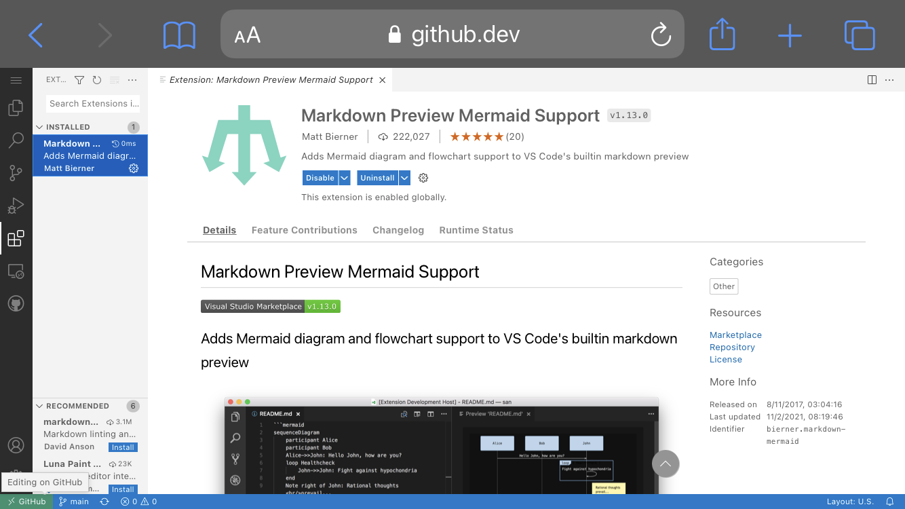

# VSCodeでmermaidを利用する方法や便利な拡張機能

Mermaid Markdown はフローチャートやガントチャート、円グラフなどをMarkdownに描けるオープンソースのライブラリです。

これを使うと、Markdownドキュメントに簡単に図形を書くことができます。

### １．便利な拡張機能
Visual Studio Code で Markdown Preview Mermaid Support をインストールします。

検索すると以下のような画面で見つけることができます。

### 2.mermaidを利用する方法
まず、Visual Studio Code で .md ファイルを作成します。

その後、以下のようにmermaidをキーワードにしてコードを記述します。

``<!---->`mermaid
//コードを記述

``<!---->`

引用サイト [World Wide Web Consortium (W3C)](https://usefuledge.com/vscodemermaidsupport.html/)